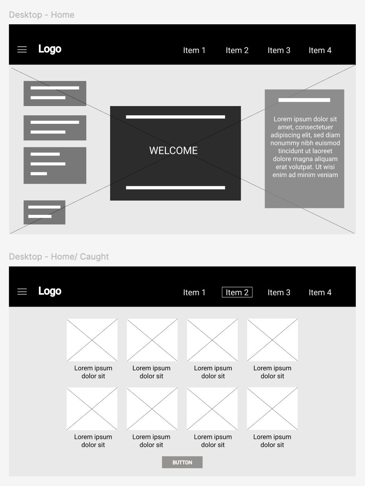

# mtm6302-capstone-chan0579

Name: Ka Ka Chan (Kasha)
Student Number: 041134101
The project you intend to complete: Pokedex

Link: https://www.figma.com/design/9WBqtXaF4d5tgy9cansGrw/Pokedex---Web-III?node-id=0-1&t=1PwruuahuxVoIYtU-1

Design explaination:

For this mockup, I used Adobe Illustrator to design the interface, creating versions for desktop, laptop, and mobile screens. The dimensions are as follows: 

Desktop: 1440x1024
Tablet: 1024x768
Mobile: 375x700

I designed the Pokedex logo and chose light blue for the heading background. This color was selected to create a calming and clear atmosphere, which fits with the idea of exploring and discovering new things,much as in the world of Pokemon.

The backgrounds include trees, sky, and ocean, creating a natural, free-spirited vibe. I chose these because, like other creatures, Pokemon belong in the wild. The outdoors is where players are intended to capture them, so it made obvious to incorporate these features to heighten the sense of adventure.

For the typography, sans serif fonts were used to create a clean, user-friendly interface with excellent readability. To emphasize headings, DIN Alternate Bold was selected for its strong, black, bold style, establishing a clear visual hierarchy.

Finally, the buttons were designed in brilliant colours to catch players' attention, engage them, and reflect the fun, interactive nature of the game. This aligns with the branding's playful and exciting spirit.